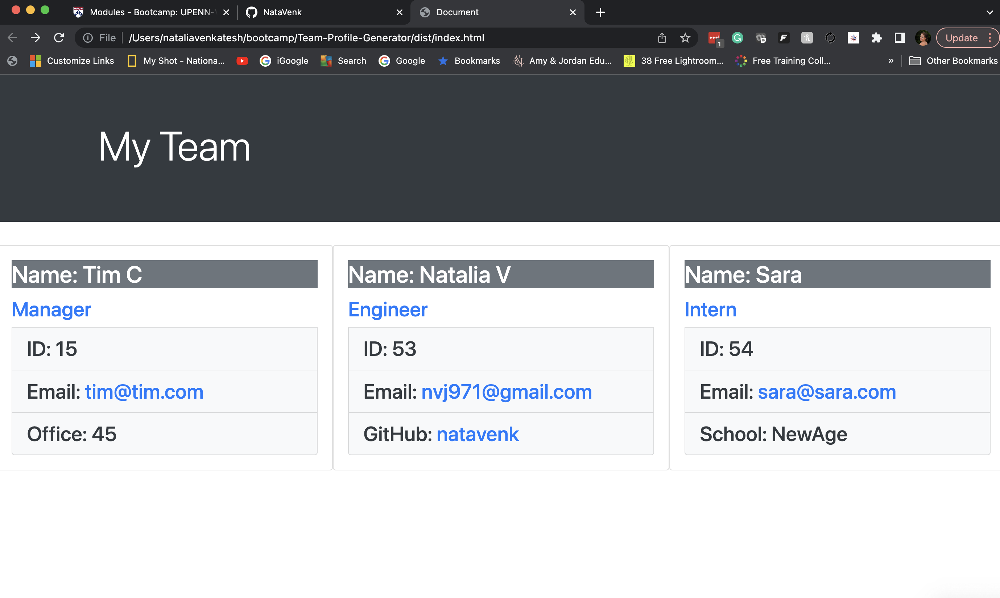

# Team-Profile-Generator

generates list if team members

## Goal

create generator that enables to enter team members on my team

## Acceptance Criteria
When I open the application I am presented with options to enter Manager, Engineer and Intern. Once i click on each option - I'm asked to provide information as following:

Manager: 
Name, Role, email, Office

Engineer:
Name, Role, email, github

Intern: 
Name, Role, email, school

When I click on email - my default email program opens and populates the TO field of the email with the address

When I click on GitHub - GitHub profile opens in a new tab

When I'm finished building my team I can exit the application, and the HTML is generated that displays a nicely formatted team roster based on user input.

## Mock-up

image of the working page

## Credits

class instructor
Sean New

## License

MIT license

IMPORTANT
Make sure that you remove dist from the .gitignore file so that Git will track this folder and include it when you push up to your application's repository.

